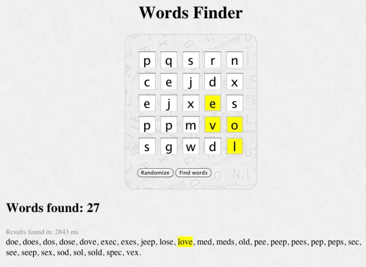

# Words Finder

## Description

You can either scatter letters in a random fashion on the letters matrix or type in the letters yourself. Then you can click a button to find all the existing words (from 3 up to 7 letters) in the letters matrix. 

If you hover on one of the words found, its letters will highlight in the matrix.

The application is [live on heroku](http://serene-gorge-4010.herokuapp.com).

## Screenshot

## Motivation

This app was a fun experiment with pure JavaScript, expressJS, Jasmine, with a focus on code readability.

## Performance

I wish I could find all words up to 8 letters, but so far I haven't been successful. Could you do it? :) In an attempt to optimize performance, the server loads from a file (instead of generating them each time) all possible paths to form a word of 3 up to 7 letters. The file is a large 17 MB, as there are 392 248 such paths. Using that strategy makes it possible to find all words in a reasonable amount of time: about a second.

## Thanks

The source for the English words list is the [12Dicts by Alan Beale](http://wordlist.aspell.net/12dicts/). Changes to the original words list include removing the duplicates and changing the format (so that I could have a file with 1 word per line). It now contains 80 863 words.

I asked a few people for a code review. Here are the people I want to thank:

* [Jonathan Palardy](https://github.com/jpalardy)
* [Mathieu Bérubé](https://github.com/mberube)
* [Matthieu Tanguay-Carel](https://github.com/matstc)
