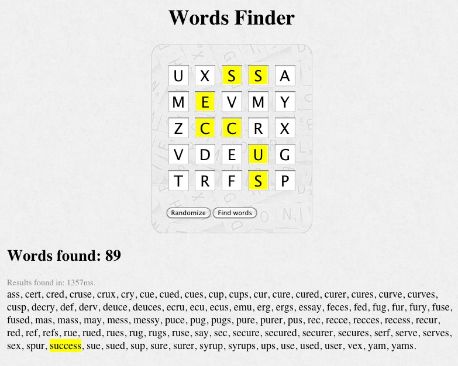

# Words Finder

## Description

You can either scatter letters in a ramdom fashion on the letters matrix or type in the letters yourself. Then you can click a button to find all the existing words (from 3 up to 6 letters) in the letters matrix. 

If you hover on one of the words found, its letters will highlight in the matrix.

## Screenshot

## Motivation

This app was an exercice to experiment with pure JavaScript app in the browser, tested with Jasmine, with a focus on code readability.

## Performance

I wish I could find all words up to 7 letters, but it's too slow. Could you do it? :) In an attempt to optimize performance, the client fetches a large (3.5 MB) json array with all the possible paths to form a word of 3 up to 6 letters (there are 95 888 such paths). The same kind of file for paths up to 7 letters was 21 MB, thus too big to be downloaded on mobiles. Using that strategy makes it possible to find all words within half a second on a desktop – less than 3 seconds on mobiles.

## Thanks

The source for the English words list is the [12Dicts by Alan Beale](http://wordlist.aspell.net/12dicts/). Changes to the original words list include removing the duplicates and changing the format (so that I could have a file with 1 word per line). It now contains 80 863 words.

I asked a few people for a code review. Here are the people I want to thank:

* [Mathieu Bérubé](https://github.com/mberube)
* [Matthieu Tanguay-Carel](https://github.com/matstc)
